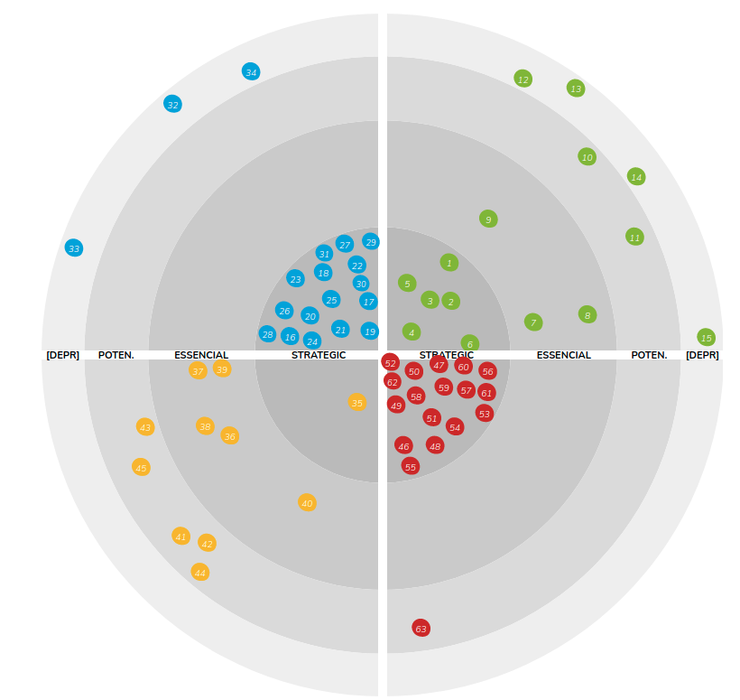

# Tech radar


## What ?

The Radar is a document that sets out the changes that are currently interesting regarding software development.  
It is published by a company called Thoughtworks.  
You can find more information about it [here](https://www.thoughtworks.com/radar/faq).

## Why ?

I have developed this radar because in many organizations we want to document the usage of technologies in an easy way.
People who wants to document something just need to push a new md file in the repository.




## How to use it ?

The tech radar is built based on the elements specified in the content folder :  
To add new content to the radar :  
* **Create a new md file** under the desired category folder in the `content` folder
    * languages-frameworks
    * platforms
    * techniques
    * tools
* **Add meta data to the file** in the front matter (in toml format)
```toml
+++
name= [name of the concept]
image= [relative image url]
category= [Languages-Frameworks or Platforms or Techniques or Tools]
ring= [Strategic or Essencial or Potencial or Deprecated]
type="post"
layout="details"
+++
```
* **Add details to the file**
    * `What is it ?` : Describe the concept / technology
    * `Why ?` : Explain why is it useful and when
    * `For who ?` : Make a list of roles that could be positively impacted by this technology (ex: Product Owner, Developers, ...)
    * `Resources` : Useful resources on this technology
    * `Contacts` : Make a list of teams or people using the technology (people that could help on the topic in the near future)

### File example
A file should look like this :
```
+++
name= "Angular"
image= "/images/languages-frameworks/angular.png"
category= "Languages-Frameworks"
ring= "Essential"
type="post"
layout="details"
+++

# What is it ?

Lorem ipsum dolor sit amet, consectetur adipiscing elit. Mauris pharetra ultricies lectus vitae elementum. Suspendisse neque nisl, venenatis vel nunc cursus, pharetra finibus elit. In aliquam nisl eu sapien pulvinar, ac ultrices justo tincidunt. Maecenas sed ipsum libero. Nulla porttitor, magna ac efficitur vestibulum, urna neque porttitor velit, ac imperdiet elit mauris vel neque. Vivamus et scelerisque libero. Aenean imperdiet dignissim viverra. Phasellus aliquet diam et velit auctor mollis. In pulvinar dolor tristique mollis dignissim. Nullam et sem ac odio interdum vehicula sed vel est.

# Why ?

Sed ullamcorper nibh eget massa dapibus hendrerit. Nulla facilisi. Aliquam erat volutpat. Ut eu ornare ipsum. Aenean molestie metus non orci faucibus pulvinar. Pellentesque maximus urna diam, vitae consectetur sapien sagittis id. Etiam enim erat, egestas id congue ut, dapibus ut lorem. Aenean scelerisque ligula id arcu rhoncus, id pharetra libero ultricies. Donec varius porta risus, a posuere libero fringilla a. Etiam id felis eu mauris euismod ullamcorper id ac massa. Aenean commodo pretium ex, et hendrerit ex pulvinar vel. Nam in nibh in eros maximus auctor. Maecenas lacus ipsum, porttitor vitae nisl ut, venenatis viverra ante. Mauris lacinia posuere sem in auctor. Quisque sed ultricies magna. Aliquam eu mauris commodo, ullamcorper turpis vestibulum, hendrerit augue.

# For who ?
* Lorem ipsum dolor sit amet, consectetur adipiscing elit.
* Nulla mattis metus a turpis fermentum, at fermentum mauris porttitor.
* Morbi porttitor magna dictum condimentum faucibus.
* Donec eget diam pharetra, hendrerit velit quis, sodales massa.
* Sed dictum nunc eu ipsum consequat, ac rutrum lectus consequat.
* Duis ut arcu mollis, pellentesque lacus eu, malesuada ante.

# Resources
- [Cheat sheet](https://angular.io/guide/cheatsheet)
- [Learn angular](https://hackr.io/tutorials/learn-angular)

# Resources (Portuguese)
```

Once you have created a new file, you can push it.
The related item will be presented on the radar.

## Update the radar javascript
If you want to customize the rendering of the radar, the javascript source code of the radar is available [here](https://github.com/agilepartner/tech-radar-js)

> To integrate the built code you have to : 
Paste the generated script in the `/layouts/_default/radar.html`script part

## Setup your dev environment
[Install hugo](https://gohugo.io/getting-started/installing/) or simply add the binary file at the root of the repository

## Serve the radar
```
hugo -w server
```

## Build the website
```
hugo --config prod.toml
```